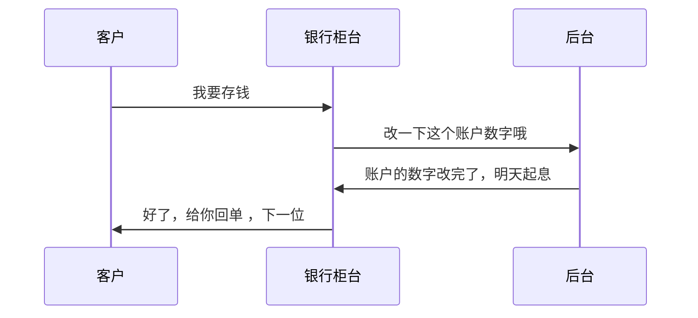

+++

title = "Markdown 语法"
description = "本文介绍了Markdown 语法"
author = "adeng"
tags = [
    "markdown"
]
date = "2021-03-25"
categories = [
    "Write",
]
menu = "main"

mermaid = true

+++


```flow
flow
st=>start: Start
op=>operation: Your Operation
cond=>condition: Yes or No?
e=>end
st->op->cond
cond(yes)->e
cond(no)->o
```




