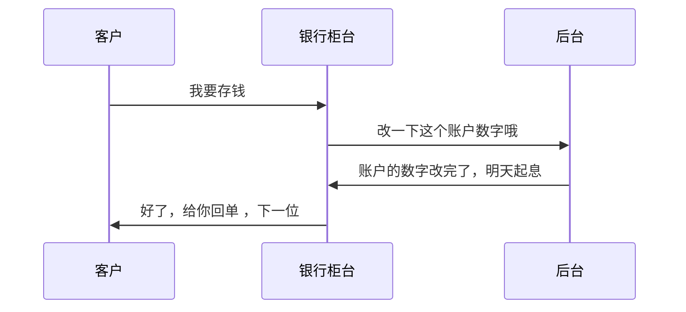

+++

title = "OAuth2"
description = "本文介绍了OAuth2"
author = "adeng"
tags = [
    "oauth2"
]
date = "2021-04-12"
categories = [
    "Standard",
]
menu = "main"

mermaid = true

+++

# OAuth2简介

```mermaid
sequenceDiagram 
客户->>银行柜台: 我要存钱  
银行柜台->>后台: 改一下这个账户数字哦  
后台->>银行柜台: 账户的数字改完了，明天起息  
银行柜台->>客户: 好了，给你回单 ，下一位
```

