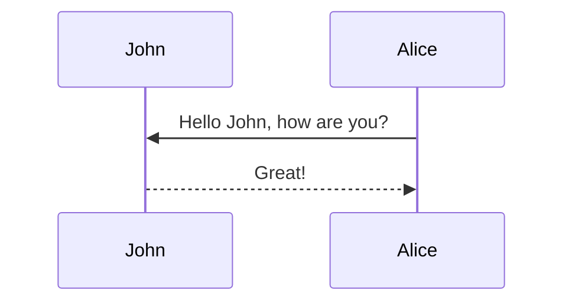

+++

title = "Mermaid 语法"
description = "本文介绍了Mermaid 语法"
author = "adeng"
tags = [
    "markdown"
]
date = "2021-04-12"
categories = [
    "Write", "Mermaid"
]
menu = "main"

mermaid = true

+++

[官方文档](https://mermaid-js.github.io/mermaid/)

# 简介

# 语法

## 时序图

